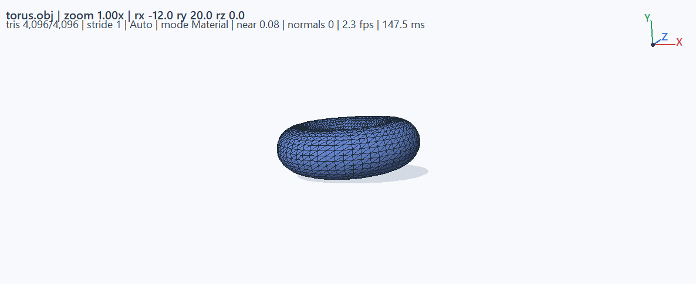

# PyOBJViewer

A dependency-free **3D model viewer for Wavefront `.obj` and `.stl` files**, written in pure Python on top of Tkinter. One file, zero required packages — run it anywhere Python runs to inspect meshes during a pipeline without spinning up a full DCC.



---

## Features

**Rendering (software rasterizer on a Tk canvas)**
- Gamma-correct **Blinn–Phong shading** — lighting is computed in linear color space and encoded back to sRGB, so falloff and mid-tones look right instead of crushed.
- **Smooth shading** using angle-weighted vertex normals (Thürmer & Wüthrich 1998) with a **crease-angle test** (52°), so curved surfaces shade smoothly while hard edges stay hard. Authored `vn` normals are used when the OBJ provides them.
- **Projected ground shadow** (Blinn-style planar shadow) that follows the light direction.
- Hemisphere ambient term — upward-facing surfaces catch a little more "sky" light.
- Painter's-algorithm depth sorting, near-plane clipping, backface culling (with invert), perspective and orthographic projection.
- Color modes: **Material**, **Depth Heatmap**, **Normal Tint**.
- Adaptive quality: triangle budget scales down automatically while you interact.

**Formats**
- **OBJ**: polygons of any arity (fan-triangulated), negative indices, `mtllib`/`usemtl` diffuse colors, authored `vn` normals, and the common `v x y z r g b` vertex-color extension.
- **STL**: binary and ASCII. Duplicated facet vertices are welded so smooth shading and mesh statistics work.

**Tools**
- **Model Info** (`F1`): vertex/triangle/edge counts, bounding size, surface area, volume (divergence theorem), boundary and non-manifold edge counts, watertightness check.
- **Snapshot export**: resolution-independent **SVG** (no dependencies), **PNG** (needs Pillow), or PostScript.
- Axis gizmo, bounding box, face-normal visualization, FPS/frame-time HUD.

**Interaction**
- Orbit, roll, pan; **mouse-wheel zoom toward the cursor**; release a drag while moving and the model **keeps gliding** with inertia.
- Auto-spin turntable with speed control, fullscreen mode, light/dark theme.

**Performance**
- Pure-stdlib by default. If **NumPy** is installed it is used automatically to vectorize vertex transform and projection for meshes above ~1.5k vertices — a large speedup on 100k+ vertex models.

---

## Requirements

- **Python 3.10+** with Tkinter (included in the standard Windows/macOS installers).
- Nothing else. Optional extras:
  - `numpy` — faster transforms on large meshes
  - `pillow` — PNG snapshot export

```bash
pip install numpy pillow   # optional
```

---

## Install (Windows)

Grab the installer from the releases page (or build it yourself, below) and run
`PyOBJViewer-Setup-2.0.0.exe`. It installs per-user (no admin prompt), adds Start Menu
shortcuts, and offers optional desktop icon and `.obj`/`.stl` file associations.
A portable `PyOBJViewer.exe` is also produced if you prefer no install at all.

> Note: the binaries are unsigned, so Windows SmartScreen may show a "more info" prompt
> on first run.

## Run from source

```bash
python main.py                       # empty viewer, use "Open OBJ"
python main.py path/to/model.obj    # open a model straight away
python main.py part.stl --dark --spin
```

CLI flags: `--dark`, `--ortho`, `--spin`, `--no-shadow`, `--quality {Auto,High,Balanced,Fast}`, `--version`.

A sample model is included: `examples/torus.obj`.

## Building the exe and installer

Requires PyInstaller + Pillow (`pip install pyinstaller pillow`) and
[Inno Setup 6](https://jrsoftware.org/isinfo.php) (`winget install JRSoftware.InnoSetup`):

```powershell
powershell -ExecutionPolicy Bypass -File packaging\build.ps1
```

Outputs land in `dist\PyOBJViewer.exe` (portable) and
`dist\installer\PyOBJViewer-Setup-2.0.0.exe` (installer).

---

## Controls

| Input | Action |
| --- | --- |
| Left-drag | Orbit (release while moving to glide) |
| Shift + left-drag | Roll |
| Right / middle-drag | Pan |
| Mouse wheel | Zoom toward cursor |
| `R` / `F` | Reset view / fit view |
| `1` `2` `3` `4` `5` | Front / top / right / back / left views |
| `W` `S` `T` | Wireframe / shading / smooth shading |
| `H` | Ground shadow |
| `C` `I` | Backface culling / invert culling |
| `D` `O` | Depth sort / orthographic |
| `M` | Cycle color mode |
| `N` `A` `G` | Normals / axes / bounding box |
| `B` | Dark background |
| Space | Auto-spin |
| `F1` | Model info |
| `F5` | Reload model |
| `F11` / Esc | Fullscreen / exit fullscreen |

---

## Project layout

```text
PyOBJViewer/
├─ main.py                     # the whole application
├─ examples/torus.obj          # sample mesh
├─ assets/icon.ico             # app icon (generated by packaging/make_icon.py)
├─ packaging/
│  ├─ build.ps1                # one-shot exe + installer build
│  ├─ make_icon.py             # icon generator
│  ├─ version_info.txt         # exe version resource
│  └─ installer.iss            # Inno Setup script
├─ docs/screenshot.png
├─ LICENSE                     # MIT
├─ SECURITY.md
└─ CODE_OF_CONDUCT.md
```

---

## Roadmap ideas

- PLY (ASCII) loading
- Per-pixel rasterization backend (z-buffer) via optional NumPy for true Gouraud shading
- MTL texture sampling (average color per face)
- Arcball (quaternion) rotation mode
- Code-signing the release binaries to avoid SmartScreen prompts

Contributions are welcome — see the Code of Conduct, and report security issues per `SECURITY.md`.

## License

MIT.
